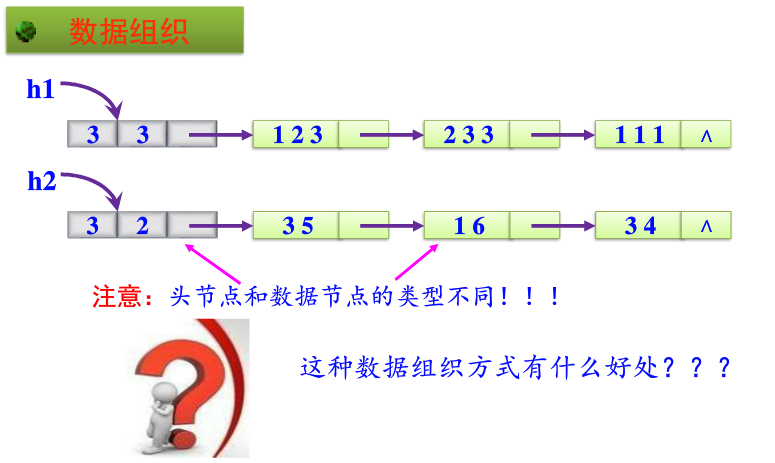
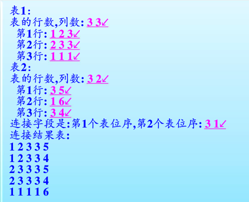

# 线性表的应用
## 两个表的自然连接
- 
- 数据组织
  - 
- 算法实现
  - 交互式创建单链表
    - ```
      void CreateTable(HList *&h)
      {
        int i,j;
        DList *r, *s;
        h = (HList *)malloc(sizeof(HList));
        h->next = NULL;
        printf("表的行数，列数:");
        scanf("%d%d", &h->Row, &h->Col);
        for (i=0; i < h->Row; i++)
        {
          printf("第%d行",i+1);
          s = (DList *)malloc(sizeof(DList));
          for (j=0; j< h->Col; j++)
            scanf("%d",&s->data[j]);
          if(h->next == NULL)
            h->next = s;
          else
            r->next = s;
          r = s;
        }
        r->next = NULL;
      }
      ```
  - 销毁
    - ```
      void DestroyTable(HList *&h)
      {
        DList *pre = h->next, *p = pre->next;
        while(p!=NULL)
        {
          free(pre);
          pre = p;
          p = p->next;
        }
        free(pre);
        free(h);
      }
      ```
  - 输出
    - ```
      void DispTable(HList *h)
      {
        int j;
        DList *p = h->next;
        while(p != NULL)
        {
          for(j=0; j < h->Col; j++)
            printf("%4d", p->data[j]);
          printf("\n");
          p = p->next;
        }
      }
      ```
  - 运算
- 最终算法实现
  - ```
    void main()
    {
      HList *h1, *h2, *h;
      printf("表1:\n");
      CreateTable(h1);
      printf("表2:\n");
      CreateTable(h2);
      LinkTable(h1, h2, h);
      printf("连接结果表:\n");
      DispTable(h);
      DestroyTable(h1);
      DestroyTable(h2);
      DestroyTable(h);
    }
    ```
  - 